# Step 1: Project Foundation, Interfaces & Configuration Technical Specification

This document details the foundation architecture of **Mind Graph DB** built during Step 1.

---

## 1. Overview & Project Layout

Mind Graph DB is organized into modular Python packages with strict type annotations (PEP 561 [`py.typed`](file:///f:/SAAS/mind-graph-db/src/mind_graph_db/py.typed)) and modern packaging using `pyproject.toml`.

```
mind-graph-db/
├── pyproject.toml
├── README.md
├── docs/
│   ├── INDEX.md
│   ├── 01_foundation.md
│   ├── 02_document_store.md
│   └── 03_embedding_vector_store.md
├── src/
│   └── mind_graph_db/
│       ├── __init__.py
│       ├── py.typed
│       ├── config/
│       │   ├── __init__.py
│       │   └── settings.py
│       ├── logging/
│       │   ├── __init__.py
│       │   └── logger.py
│       ├── core/
│       │   ├── __init__.py
│       │   └── types.py
│       └── interfaces/
│           ├── __init__.py
│           ├── document_store.py
│           ├── vector_store.py
│           ├── graph_store.py
│           ├── embedding.py
│           ├── nlp.py
│           └── query_engine.py
└── tests/
```

---

## 2. Interface Class Hierarchy

All system capabilities (Document Store, Vector Store, Graph Store, Embedding Model, NLP Model, Query Engine) are defined strictly behind abstract base classes (`abc.ABC`).

```mermaid
classDiagram
    class DocumentStore {
        <<abstract>>
        +put(document: Document) str
        +get(document_id: str) Optional~Document~
        +update(document: Document) bool
        +delete(document_id: str) bool
        +list_documents(limit: int, offset: int) List~Document~
        +count() int
    }

    class VectorStore {
        <<abstract>>
        +add(vector_id: str, embedding: List~float~, metadata: Dict) None
        +get(vector_id: str) Optional~Vector~
        +search(query_embedding: List~float~, top_k: int, filters: Dict) List~Tuple~
        +delete(vector_id: str) bool
        +count() int
    }

    class GraphStore {
        <<abstract>>
        +add_entity(entity: Entity) str
        +get_entity(entity_id: str) Optional~Entity~
        +add_relationship(relationship: Relationship) None
        +get_neighbors(entity_id: str, relation_types: List, max_depth: int) List~Tuple~
        +delete_entity(entity_id: str) bool
        +query_subgraph(start_entity_ids: List, depth: int) Dict
    }

    class EmbeddingModel {
        <<abstract>>
        +encode_text(text: str) List~float~
        +encode_batch(texts: List~str~) List~List~float~~
        +dimension int*
    }

    class NLPModel {
        <<abstract>>
        +extract_entities(text: str) List~Entity~
        +extract_relationships(text: str, entities: List~Entity~) List~Relationship~
    }

    class QueryEngine {
        <<abstract>>
        +query(query_text: str, top_k: int, filters: Dict, include_subgraph: bool) QueryResult
    }
```



---

## 3. Configuration Management

Configuration is handled in [settings.py](file:///f:/SAAS/mind-graph-db/src/mind_graph_db/config/settings.py) via Pydantic `BaseSettings`. Environment variables prefixed with `MIND_GRAPH_DB_` override default values:

| Environment Variable | Config Field | Type | Default Value | Description |
| :--- | :--- | :--- | :--- | :--- |
| `MIND_GRAPH_DB_ENVIRONMENT` | `environment` | `str` | `"development"` | Application environment (`development`, `testing`, `production`). |
| `MIND_GRAPH_DB_LOG_LEVEL` | `log_level` | `str` | `"INFO"` | Logging output level (`DEBUG`, `INFO`, `WARNING`, `ERROR`). |
| `MIND_GRAPH_DB_STORAGE_PATH` | `storage_path` | `str` | `"./storage"` | Base directory for disk persistent storage engines. |
| `MIND_GRAPH_DB_EMBEDDING_DIMENSION` | `embedding_dimension` | `int` | `384` | Default vector dimension size for fallback embedding models. |
| `MIND_GRAPH_DB_DEFAULT_TOP_K` | `default_top_k` | `int` | `10` | Default number of top results returned in search queries. |
| `MIND_GRAPH_DB_EMBEDDING_MODEL_NAME` | `embedding_model_name` | `str` | `"all-MiniLM-L6-v2"` | Pretrained sentence-transformer embedding model identifier. |

---

## 4. Core Domain Objects

Defined in [types.py](file:///f:/SAAS/mind-graph-db/src/mind_graph_db/core/types.py):

- **`Document`**: Represents an unstructured text document with ID, text, metadata dictionary, and ISO-8601 UTC timestamps.
- **`Entity`**: Represents an extracted or user-defined named entity (ID, name, entity type, metadata).
- **`Relationship`**: Represents a directed edge between two entities (source_id, target_id, relation_type, confidence score, metadata).
- **`Vector`**: Represents high-dimensional float array embeddings with associated metadata.
- **`QueryResult`**: Unified response containing ranked documents, extracted entities, relationships, and similarity scores.
