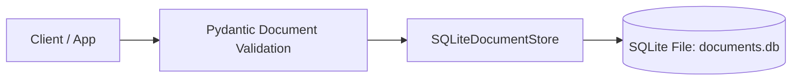
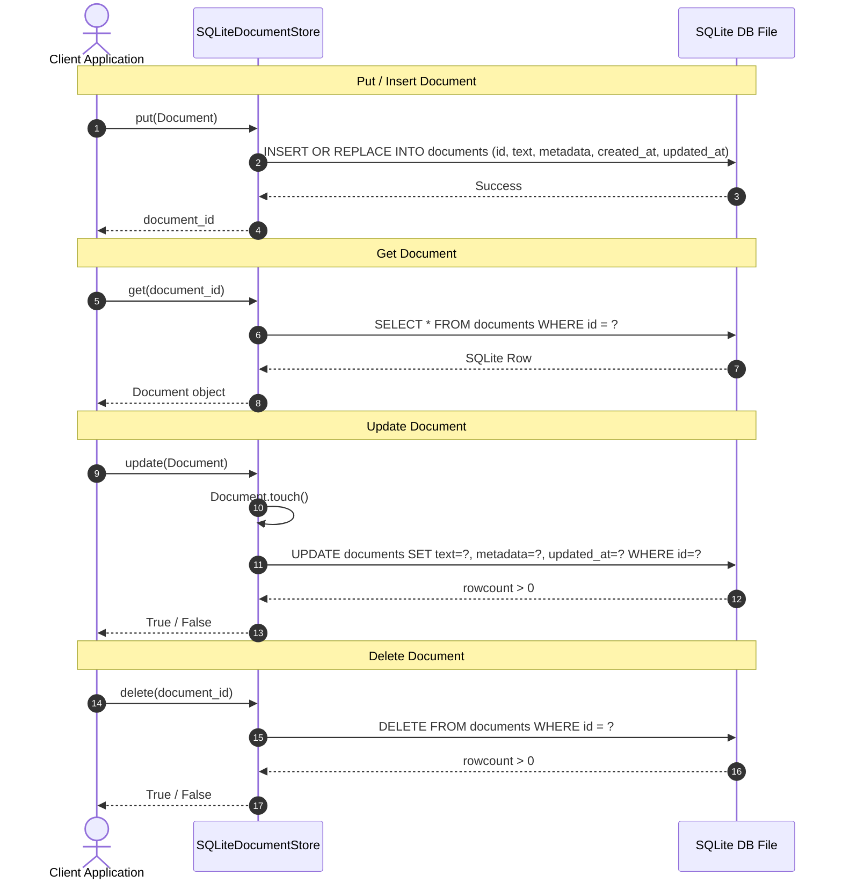

# Step 2: Document Storage Layer Technical Specification

This document details the **Document Storage Layer** implemented in Step 2, providing local persistent storage for raw text documents and metadata.

---

## 1. Document Storage Architecture

The Document Storage Layer encapsulates document validation, UUID assignment, timestamp maintenance, and persistent disk storage behind the `DocumentStore` interface.



---

## 2. Document Validation & Lifecycle

The `Document` model enforces the following constraints during initialization and updates:

1. **Auto-Generated ID**: If `id` is not specified, a UUIDv4 string (`uuid.uuid4()`) is automatically generated.
2. **Text Validation**: Text content cannot be empty or contain whitespace-only characters (`validate_text_not_empty` validator).
3. **UTC Timestamps**: `created_at` and `updated_at` are automatically populated with timezone-aware UTC datetimes (`datetime.now(timezone.utc)`).
4. **Touch Timestamp Update**: Calling `document.touch()` updates `updated_at` to the current UTC timestamp when content is modified.

---

## 3. SQLite Storage Engine Schema (`SQLiteDocumentStore`)

The primary persistent document storage engine is `SQLiteDocumentStore` located in [src/mind_graph_db/storage/sqlite_document_store.py](file:///f:/SAAS/mind-graph-db/src/mind_graph_db/storage/sqlite_document_store.py).

### Table Schema DDL

```sql
CREATE TABLE IF NOT EXISTS documents (
    id TEXT PRIMARY KEY,
    text TEXT NOT NULL,
    metadata TEXT NOT NULL,
    created_at TEXT NOT NULL,
    updated_at TEXT NOT NULL
);
```

### Field Mapping Matrix

| SQLite Column | Python Type | Serialization / Conversion | Notes |
| :--- | :--- | :--- | :--- |
| `id` | `str` | Direct string | Primary Key. |
| `text` | `str` | Direct string | Unstructured document text content. |
| `metadata` | `Dict[str, Any]` | `json.dumps()` / `json.loads()` | JSON encoded dictionary. |
| `created_at` | `datetime` | `datetime.isoformat()` / `fromisoformat()` | ISO-8601 UTC timestamp string. |
| `updated_at` | `datetime` | `datetime.isoformat()` / `fromisoformat()` | ISO-8601 UTC timestamp string. |

---

## 4. CRUD Operation Sequence



---

## 5. Usage Code Examples

```python
from mind_graph_db.core.types import Document
from mind_graph_db.storage import SQLiteDocumentStore

# 1. Initialize local persistent store
store = SQLiteDocumentStore(db_path="./storage/documents.db")

# 2. Insert new document
doc = Document(
    text="Mind Graph DB provides persistent document storage.",
    metadata={"author": "Alice", "tags": ["db", "python"]},
)
doc_id = store.put(doc)
print(f"Stored Document ID: {doc_id}")

# 3. Retrieve document
retrieved = store.get(doc_id)
if retrieved:
    print(f"Retrieved Text: {retrieved.text}")

# 4. Update document
retrieved.text = "Mind Graph DB provides local persistent document storage via SQLite."
store.update(retrieved)

# 5. List & Paginate
total_count = store.count()
paginated_docs = store.list_documents(limit=10, offset=0)

store.close()
```
