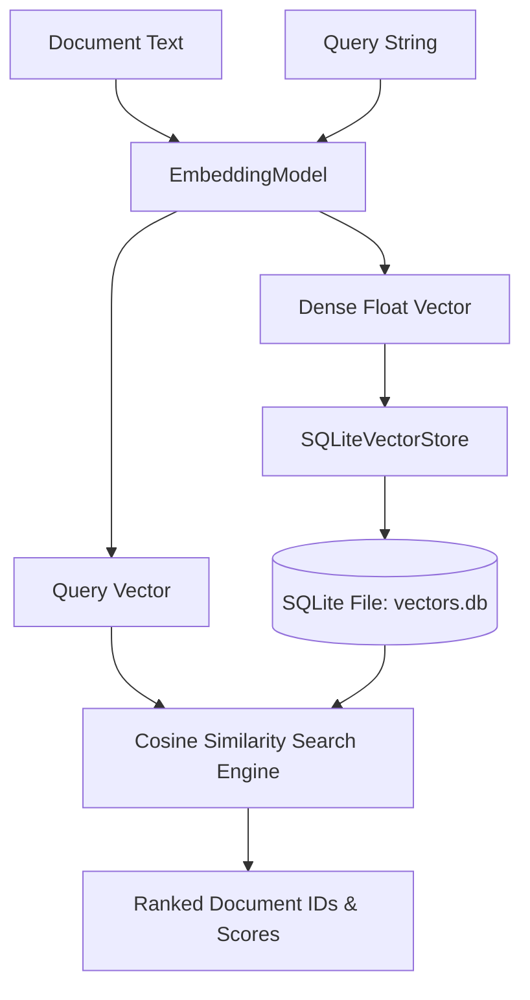
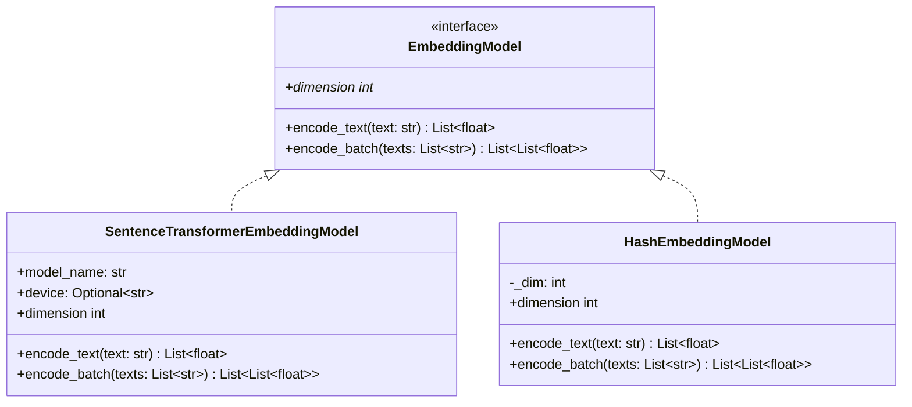
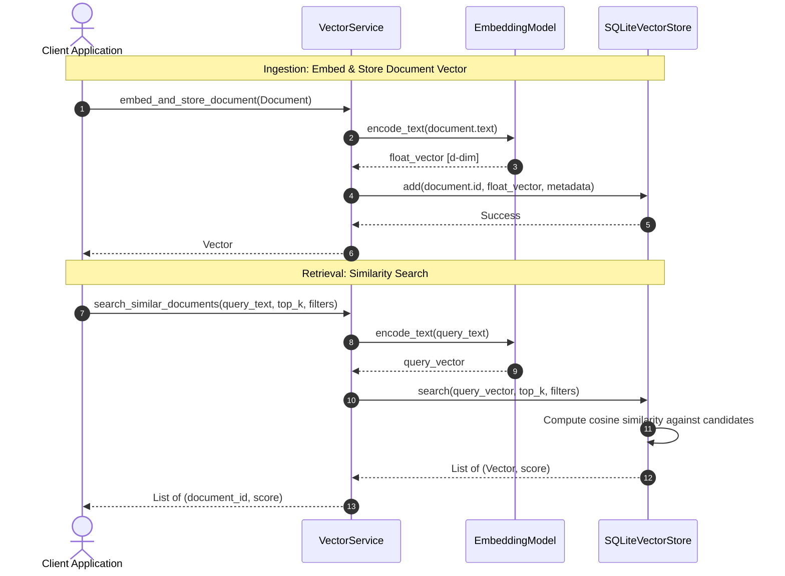

# Step 3: Embedding & Vector Storage Layer Technical Specification

This document details the **Embedding & Vector Storage Layer** implemented in Step 3, enabling dense vector generation, separate persistent vector storage, and exact cosine similarity search.

---

## 1. Embedding & Vector Storage Architecture

The Embedding Layer generates high-dimensional float arrays from document text, which are stored separately from raw document text in a dedicated local vector store.



---

## 2. Embedding Model Hierarchy & Factory

All embedding models extend the [EmbeddingModel](file:///f:/SAAS/mind-graph-db/src/mind_graph_db/interfaces/embedding.py) interface.



### Model Factory (`get_embedding_model`)
Factory function `get_embedding_model(model_name, fallback_to_hash)` in [embeddings/__init__.py](file:///f:/SAAS/mind-graph-db/src/mind_graph_db/embeddings/__init__.py):
- Attempts to initialize `SentenceTransformerEmbeddingModel` using the configured model name (`Settings.embedding_model_name`).
- If `sentence-transformers` is not installed and `fallback_to_hash=True`, seamlessly falls back to `HashEmbeddingModel`.

---

## 3. SQLite Vector Store Engine (`SQLiteVectorStore`)

The vector storage engine [SQLiteVectorStore](file:///f:/SAAS/mind-graph-db/src/mind_graph_db/storage/sqlite_vector_store.py) stores vectors separately from text.

### Table Schema DDL

```sql
CREATE TABLE IF NOT EXISTS vectors (
    id TEXT PRIMARY KEY,
    embedding TEXT NOT NULL,
    metadata TEXT NOT NULL
);
```

### Cosine Similarity Metric Formulation

The similarity score between a search query vector $u$ and stored vector $v$ is computed as the normalized dot product:

$$\text{similarity}(u, v) = \frac{\sum_{i=1}^{d} u_i v_i}{\sqrt{\sum_{i=1}^{d} u_i^2} \sqrt{\sum_{i=1}^{d} v_i^2}}$$

- **Score Range**: $[-1.0, 1.0]$, where $1.0$ indicates identical direction (highest semantic similarity).
- **Metadata Filtering**: If `filters` are provided (e.g., `{"category": "database"}`), candidate vectors are filtered prior to score sorting.

---

## 4. Vector Service Pipeline (`VectorService`)

The [VectorService](file:///f:/SAAS/mind-graph-db/src/mind_graph_db/services/vector_service.py) coordinates document embedding and similarity search workflows:



---

## 5. Usage Code Examples

```python
from mind_graph_db.core.types import Document
from mind_graph_db.embeddings import get_embedding_model
from mind_graph_db.services import VectorService
from mind_graph_db.storage import SQLiteVectorStore

# 1. Initialize components
model = get_embedding_model("all-MiniLM-L6-v2")
vector_store = SQLiteVectorStore(db_path="./storage/vectors.db")
service = VectorService(embedding_model=model, vector_store=vector_store)

# 2. Ingest document and store vector separately
doc = Document(
    id="doc-semantic-search",
    text="Vector similarity search retrieves relevant documents by dense embeddings.",
    metadata={"domain": "ai"},
)
service.embed_and_store_document(doc)

# 3. Perform similarity search
query = "dense vector retrieval for AI"
results = service.search_similar_documents(query_text=query, top_k=5)

for doc_id, score in results:
    print(f"Matched Document ID: {doc_id} | Similarity Score: {score:.4f}")

vector_store.close()
```
