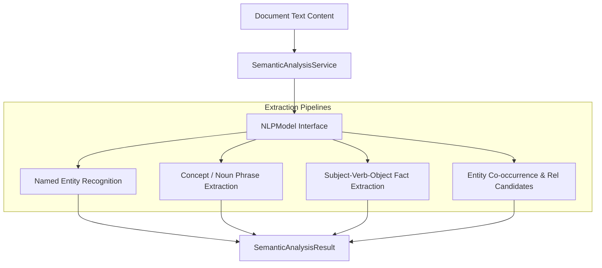
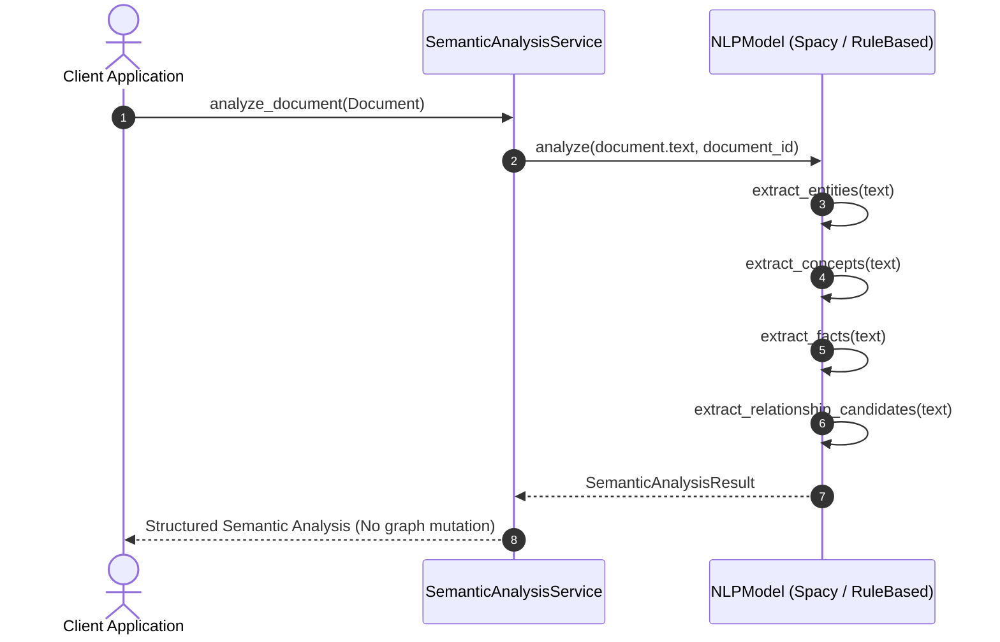

# Step 4: Semantic Analysis Layer Technical Specification

This document details the **Semantic Analysis Layer** implemented in Step 4, extracting entities, entity types, important concepts, SVO (Subject-Verb-Object) facts, and relationship candidates from unstructured text documents using open-source pretrained NLP models.

---

## 1. Semantic Analysis Architecture

The Semantic Analysis Layer converts raw text content into structured semantic representations without automatically mutating the knowledge graph.



---

## 2. Core Domain Models

Defined in [types.py](file:///f:/SAAS/mind-graph-db/src/mind_graph_db/core/types.py):

### Fact Model (`Fact`)
Represents an extracted Subject-Verb-Object factual triple:
- **`subject`**: Subject entity or term.
- **`predicate`**: Action or verb relation (e.g., `"provides"`, `"uses"`, `"is"`).
- **`object_`**: Target object term or clause.
- **`confidence`**: Floating point extraction confidence score $[0.0, 1.0]$.

### Relationship Candidate Model (`RelationshipCandidate`)
Represents candidate entity-to-entity relationships extracted from text evidence prior to graph commit:
- **`source_entity`**: Originating `Entity` instance.
- **`target_entity`**: Destination `Entity` instance.
- **`relation_type`**: Type label (e.g. `"CO_OCCURS_WITH"`, `"CONNECTED_TO"`).
- **`confidence`**: Confidence score $[0.0, 1.0]$.
- **`evidence_text`**: Surrounding sentence or text snippet providing extraction evidence.

### Semantic Analysis Result (`SemanticAnalysisResult`)
Structured response containing:
- **`document_id`**: Identifier of originating document (if applicable).
- **`entities`**: List of extracted `Entity` objects.
- **`concepts`**: List of key concept string labels.
- **`facts`**: List of `Fact` SVO triples.
- **`relationship_candidates`**: List of `RelationshipCandidate` objects.

---

## 3. NLP Model Implementations

### `SpacyNLPModel`
Uses open-source spaCy pretrained pipelines (`en_core_web_sm` / `en_core_web_md`):
- **NER**: Extracts entities with labels (`PERSON`, `ORG`, `GPE`, `DATE`, `PRODUCT`, `EVENT`).
- **Noun Chunks**: Extracts noun phrases as domain concepts.
- **Dependency Parsing**: Traverses dependency tree (`nsubj` $\rightarrow$ `ROOT` $\rightarrow$ `dobj/pobj`) to extract SVO `Fact` triples.

### `RuleBasedNLPModel`
Zero-dependency heuristic regex NLP engine for unit testing and offline environments:
- Uses regular expressions for capitalized proper nouns, non-stopword tokens, SVO verb sentence patterns, and co-occurrence relationship candidates.

### Factory Function (`get_nlp_model`)
Factory in [nlp/__init__.py](file:///f:/SAAS/mind-graph-db/src/mind_graph_db/nlp/__init__.py) attempting `SpacyNLPModel` and falling back to `RuleBasedNLPModel`.

---

## 4. Ingestion Sequence Diagram



---

## 5. Usage Code Examples

```python
from mind_graph_db.core.types import Document
from mind_graph_db.nlp import get_nlp_model
from mind_graph_db.services import SemanticAnalysisService

# Initialize NLP model & service
nlp_model = get_nlp_model("en_core_web_sm")
service = SemanticAnalysisService(nlp_model=nlp_model)

# Create document
doc = Document(
    id="doc-nlp-1",
    text="Mind Graph DB is built by Python developers. Python integrates with SQLite to store semantic data.",
)

# Perform semantic analysis
result = service.analyze_document(doc)

print("Entities:", [e.name for e in result.entities])
print("Concepts:", result.concepts)
print("Facts:", [(f.subject, f.predicate, f.object_) for f in result.facts])
print("Candidates:", [(c.source_entity.name, c.relation_type, c.target_entity.name) for c in result.relationship_candidates])
```
