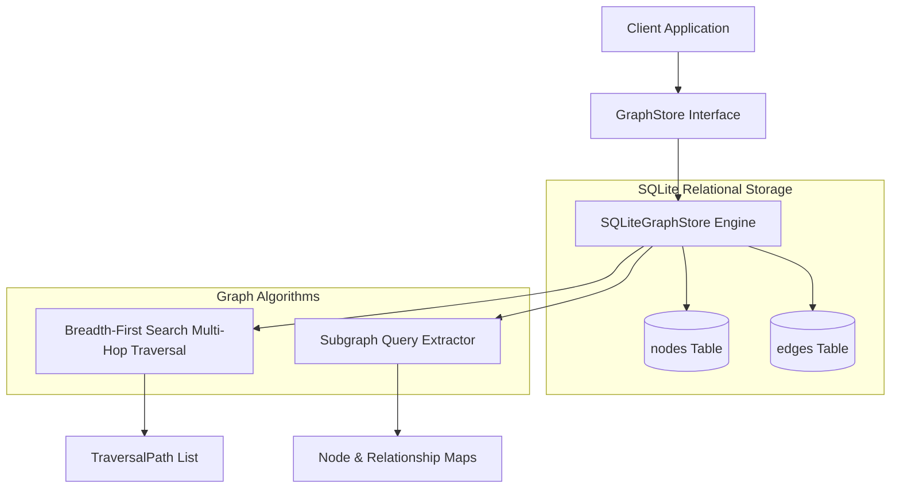
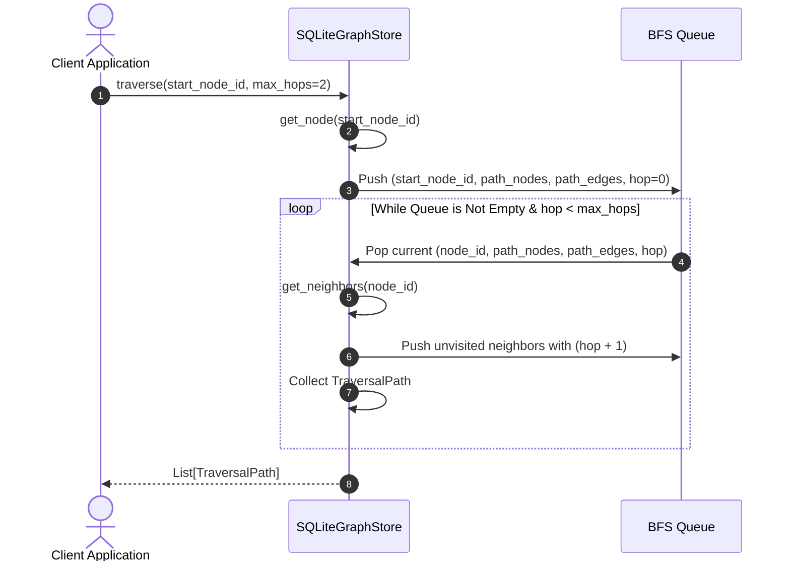

# Step 5: Custom Graph Storage Layer Technical Specification

This document details the **Custom Graph Storage Layer** implemented in Step 5, providing persistent graph storage for `GraphNode` (Entities, Documents, Concepts) and directed `Relationship` edges with confidence scores, relationship types, and evidence provenance, supporting multi-hop graph traversal without Neo4j.

---

## 1. Graph Storage Architecture

The Graph Storage Layer provides persistent graph management and multi-hop path traversal behind the `GraphStore` interface.



---

## 2. Core Graph Models

Defined in [types.py](file:///f:/SAAS/mind-graph-db/src/mind_graph_db/core/types.py):

### `GraphNode` Model
- **`id`**: Unique node string identifier (auto-generated UUIDv4 if omitted).
- **`label`**: Display label or name string (e.g., `"Python"`, `"Document-101"`).
- **`node_type`**: Type classification (`"ENTITY"`, `"DOCUMENT"`, `"CONCEPT"`).
- **`properties`**: Key-value metadata property payload dictionary.

### `Relationship` Edge Model
- **`id`**: Unique edge string identifier.
- **`source_id`**: Source node ID.
- **`target_id`**: Target node ID.
- **`relation_type`**: Semantic relation label (e.g. `"USES_STORAGE"`, `"WRITTEN_IN"`, `"MENTIONS"`).
- **`confidence`**: Floating point confidence score $[0.0, 1.0]$.
- **`evidence_text`**: Optional evidence snippet string proving edge extraction.
- **`properties`**: Additional edge metadata dictionary.

### `TraversalPath` Model
- **`nodes`**: Ordered list of `GraphNode` objects traversed along the path.
- **`edges`**: Ordered list of connecting `Relationship` edge objects.
- **`hop_count`**: Integer hop count depth ($1$-hop, $2$-hop, $3$-hop, etc.).

---

## 3. SQLite Storage Engine Schema (`SQLiteGraphStore`)

`SQLiteGraphStore` in [sqlite_graph_store.py](file:///f:/SAAS/mind-graph-db/src/mind_graph_db/storage/sqlite_graph_store.py) persists nodes and edges locally in SQLite (`storage/graph.db`).

### DDL Schema

```sql
CREATE TABLE IF NOT EXISTS nodes (
    id TEXT PRIMARY KEY,
    label TEXT NOT NULL,
    node_type TEXT NOT NULL,
    properties TEXT NOT NULL
);

CREATE TABLE IF NOT EXISTS edges (
    id TEXT PRIMARY KEY,
    source_id TEXT NOT NULL,
    target_id TEXT NOT NULL,
    relation_type TEXT NOT NULL,
    confidence REAL NOT NULL,
    evidence_text TEXT,
    properties TEXT NOT NULL
);

CREATE INDEX IF NOT EXISTS idx_edges_source ON edges(source_id);
CREATE INDEX IF NOT EXISTS idx_edges_target ON edges(target_id);
```

---

## 4. Multi-Hop BFS Traversal Pipeline



---

## 5. Usage Code Examples

```python
from mind_graph_db.core.types import GraphNode, Relationship
from mind_graph_db.storage import SQLiteGraphStore

# 1. Initialize persistent graph store
store = SQLiteGraphStore(db_path="./storage/graph.db")

# 2. Add nodes (Entities and Documents)
node_a = GraphNode(id="nA", label="Mind Graph DB", node_type="ENTITY")
node_b = GraphNode(id="nB", label="SQLite Engine", node_type="ENTITY")
node_c = GraphNode(id="nC", label="Vector Index", node_type="CONCEPT")

store.add_node(node_a)
store.add_node(node_b)
store.add_node(node_c)

# 3. Add relationship edges with confidence and evidence provenance
rel1 = Relationship(
    source_id="nA",
    target_id="nB",
    relation_type="USES_STORAGE",
    confidence=0.95,
    evidence_text="Mind Graph DB uses SQLite engine for local persistence.",
)
rel2 = Relationship(source_id="nB", target_id="nC", relation_type="HAS_INDEX", confidence=0.90)

store.add_relationship(rel1)
store.add_relationship(rel2)

# 4. Multi-hop traversal (2-hop exploration from nA)
paths = store.traverse("nA", max_hops=2)
for path in paths:
    print(f"Hop Count: {path.hop_count} | End Node: {path.nodes[-1].label}")

# 5. Delete relationship or node with cascading edge cleanup
store.delete_relationship("nA", "nB", relation_type="USES_STORAGE")
store.delete_node("nA")

store.close()
```
