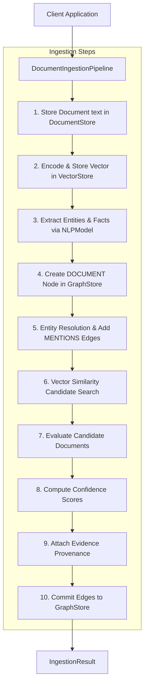
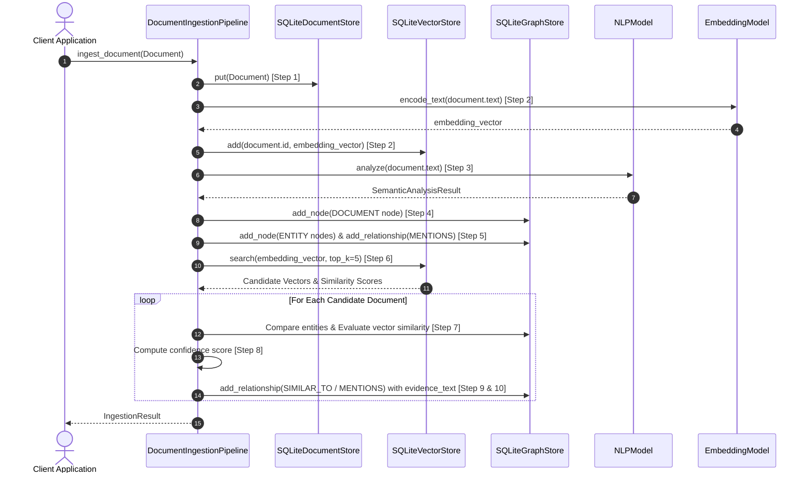

# Step 6: Automatic Knowledge Graph Discovery & Ingestion Pipeline Technical Specification

This document details the **Automatic Knowledge Graph Discovery & Ingestion Pipeline** (`DocumentIngestionPipeline`) implemented in Step 6.

---

## 1. Automated Pipeline Architecture

The ingestion pipeline automates raw text document storage, vector embedding indexing, semantic extraction, vector candidate discovery, cross-document entity resolution, confidence scoring, evidence provenance logging, and knowledge graph persistence.



---

## 2. The 10-Step Ingestion Workflow



---

## 3. Candidate Discovery & Entity Resolution

### Vector Candidate Discovery ($O(1)$ ANN / Top-K Search)
Instead of performing an expensive $O(N)$ pairwise comparison against every document in the database, the pipeline queries `VectorStore.search(query_embedding, top_k=5)`. Only top candidate documents exceeding `min_confidence` are evaluated.

### Entity Resolution
Entities extracted from new documents are normalized to canonical labels. Entity nodes are inserted into `GraphStore` as `GraphNode(node_type="ENTITY")`. Incoming documents create `"MENTIONS"` edges targeting resolved entity nodes.

### Evidence Provenance Logging
Every relationship committed into `GraphStore` attaches explicit evidence text in its `evidence_text` attribute:
- **`MENTIONS` Edges**: `f"Document '{doc_id}' explicitly mentions entity '{entity_name}'"`
- **`SIMILAR_TO` Edges**: `f"Vector cosine similarity ({sim_score:.3f}) between doc '{doc_id}' and doc '{cand_doc_id}'"`
- **Cross-Document Entity Links**: `f"Entity '{entity_name}' resolved across vector similar doc '{cand_doc_id}' (similarity={sim_score:.3f})"`

---

## 4. Usage Code Examples

```python
from mind_graph_db.core.types import Document
from mind_graph_db.embeddings import get_embedding_model
from mind_graph_db.nlp import get_nlp_model
from mind_graph_db.pipeline import DocumentIngestionPipeline
from mind_graph_db.storage import SQLiteDocumentStore, SQLiteGraphStore, SQLiteVectorStore

# 1. Initialize storage & model components
doc_store = SQLiteDocumentStore(db_path="./storage/documents.db")
vec_store = SQLiteVectorStore(db_path="./storage/vectors.db")
graph_store = SQLiteGraphStore(db_path="./storage/graph.db")

embedding_model = get_embedding_model("all-MiniLM-L6-v2")
nlp_model = get_nlp_model("en_core_web_sm")

# 2. Instantiate pipeline
pipeline = DocumentIngestionPipeline(
    document_store=doc_store,
    vector_store=vec_store,
    graph_store=graph_store,
    embedding_model=embedding_model,
    nlp_model=nlp_model,
    min_confidence=0.6,
    candidate_top_k=5,
)

# 3. Ingest documents
doc1 = Document(text="Python is used by Google for AI applications.")
res1 = pipeline.ingest_document(doc1)

doc2 = Document(text="Python integrates with SQLite to store semantic data. OpenAI uses Python.")
res2 = pipeline.ingest_document(doc2)

print(f"Ingested Doc 2 | Relationships Created: {res2.relationships_created}")

# 4. Explore automatically discovered knowledge graph
paths = graph_store.traverse(doc1.id, max_hops=2)
for path in paths:
    print(f"Path Hop {path.hop_count}: {[n.label for n in path.nodes]}")

doc_store.close()
vec_store.close()
graph_store.close()
```
