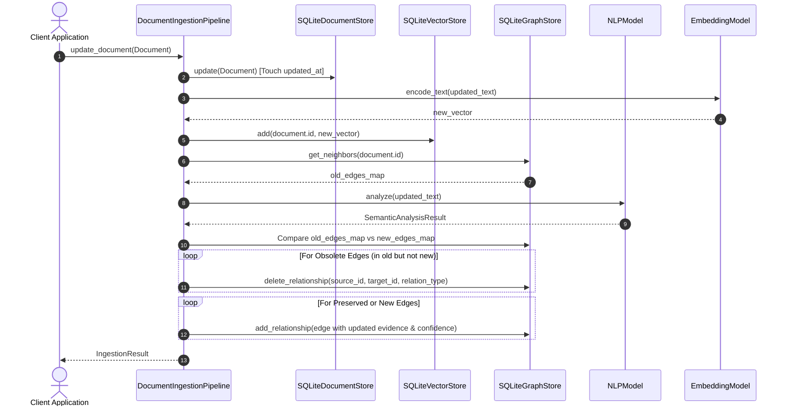

# Step 7: Document Updates & Stale Relationship Cleanup Technical Specification

This document details the **Document Update & Stale Relationship Cleanup Pipeline** (`DocumentIngestionPipeline.update_document`) implemented in Step 7.

---

## 1. Document Update & Reconciliation Architecture

When an existing document's raw text or metadata changes, the update pipeline ensures complete consistency across storage layers (`DocumentStore`, `VectorStore`, `GraphStore`).

```mermaid
graph TD
    User[Client Application] --> Pipeline[DocumentIngestionPipeline.update_document]
    
    subgraph Reconciliation Stages
        Pipeline --> Touch[1. Touch updated_at & Update DocumentStore]
        Touch --> Embed[2. Regenerate & Overwrite Vector in VectorStore]
        Embed --> Snapshot[3. Capture Existing Graph Edges State]
        Snapshot --> Analyze[4. Re-run Semantic NLP Extraction & Candidate Search]
        Analyze --> Reconcile[5. Reconcile Old vs. New Relationships]
        
        subgraph Graph Reconciliation Engine
            Reconcile --> Prune[Prune Obsolete Edges (Removed Text)]
            Reconcile --> Preserve[Preserve & Update Valid Edges + Evidence]
            Reconcile --> AddNew[Commit Newly Formed Edges]
        end

        Reconcile --> NodeUpdate[6. Update DOCUMENT Node Properties]
    end

    NodeUpdate --> Result[IngestionResult (Created, Updated, Removed Counts)]
```

---

## 2. Document Update Sequence Diagram



---

## 3. Stale Edge Pruning & Relationship Preservation Logic

### Edge Key Matching
Relationships connected to `document.id` are indexed by composite key `(source_id, target_id, relation_type)`.

1. **Obsolete Edges ($E_{\text{old}} \setminus E_{\text{new}}$)**:
   - Relationships supported by previous document text that are no longer present in the updated text are deleted via `GraphStore.delete_relationship()`.
2. **Preserved Edges ($E_{\text{old}} \cap E_{\text{new}}$)**:
   - Relationships supported by both previous and updated text are retained, updating their `confidence` score and `evidence_text` with current ISO-8601 timestamps.
3. **Newly Formed Edges ($E_{\text{new}} \setminus E_{\text{old}}$)**:
   - New semantic links created by added entities or content are committed into `GraphStore`.

---

## 4. Usage Code Examples

```python
from mind_graph_db.core.types import Document
from mind_graph_db.embeddings import get_embedding_model
from mind_graph_db.nlp import get_nlp_model
from mind_graph_db.pipeline import DocumentIngestionPipeline
from mind_graph_db.storage import SQLiteDocumentStore, SQLiteGraphStore, SQLiteVectorStore

# 1. Setup pipeline
doc_store = SQLiteDocumentStore(db_path="./storage/documents.db")
vec_store = SQLiteVectorStore(db_path="./storage/vectors.db")
graph_store = SQLiteGraphStore(db_path="./storage/graph.db")

pipeline = DocumentIngestionPipeline(
    document_store=doc_store,
    vector_store=vec_store,
    graph_store=graph_store,
    embedding_model=get_embedding_model("all-MiniLM-L6-v2"),
    nlp_model=get_nlp_model("en_core_web_sm"),
)

# 2. Ingest original document
doc = Document(id="doc-100", text="Python is used by Google for backend infrastructure.")
res1 = pipeline.ingest_document(doc)

# 3. Update document content (Replace Google with OpenAI)
doc.text = "Python is used by OpenAI to build large language models."
res2 = pipeline.update_document(doc)

print(f"Relationships Removed: {res2.relationships_removed}")  # Google edge removed
print(f"Relationships Created: {res2.relationships_created}")  # OpenAI edge added
print(f"Relationships Updated: {res2.relationships_updated}")  # Python edge preserved

doc_store.close()
vec_store.close()
graph_store.close()
```
