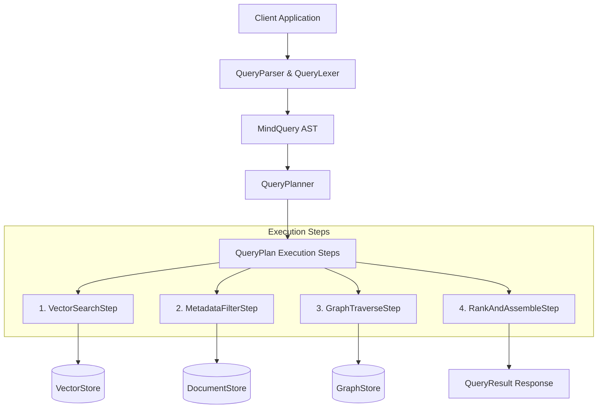
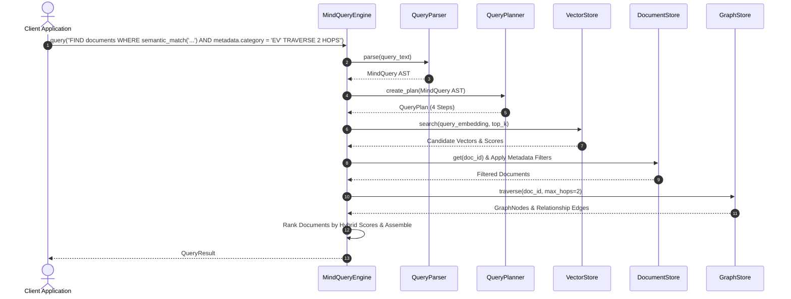

# Step 8: Custom Domain Query Language & Execution Engine Technical Specification

This document details the **Custom Domain-Specific Query Language & Query Execution Engine** (`MindQueryEngine`) implemented in Step 8.

---

## 1. Query Engine Architecture

The Query Engine parses custom domain query strings, compiles them into optimized multi-stage execution plans, executes hybrid vector search, metadata filtering, and multi-hop graph traversal, and ranks results.



---

## 2. Query Language EBNF Grammar

```ebnf
Query ::= FindClause WhereClause? TraverseClause? ReturnClause?

FindClause ::= "FIND" Target
Target     ::= "documents" | "entities" | "subgraph"

WhereClause ::= "WHERE" ConditionExpr
ConditionExpr ::= Condition ("AND" Condition)*
Condition   ::= SemanticMatchCond | MetadataCond

SemanticMatchCond ::= "semantic_match" "(" STRING_LITERAL ")"
MetadataCond     ::= "metadata." IDENTIFIER "=" (STRING_LITERAL | NUMBER)

TraverseClause ::= "TRAVERSE" INT_LITERAL "HOPS" ("WITH RELATIONSHIPS" StringList)?
ReturnClause   ::= "RETURN" ReturnList
ReturnList     ::= ReturnItem ("," ReturnItem)*
ReturnItem     ::= "documents" | "entities" | "relationships" | "scores"
```

---

## 3. Query Execution Sequence Diagram



---

## 4. Usage Code Examples

```python
from mind_graph_db.embeddings import get_embedding_model
from mind_graph_db.query import MindQueryEngine
from mind_graph_db.storage import SQLiteDocumentStore, SQLiteGraphStore, SQLiteVectorStore

# 1. Initialize components
doc_store = SQLiteDocumentStore(db_path="./storage/documents.db")
vec_store = SQLiteVectorStore(db_path="./storage/vectors.db")
graph_store = SQLiteGraphStore(db_path="./storage/graph.db")
embedding_model = get_embedding_model("all-MiniLM-L6-v2")

# 2. Instantiate Query Engine
engine = MindQueryEngine(
    document_store=doc_store,
    vector_store=vec_store,
    graph_store=graph_store,
    embedding_model=embedding_model,
)

# 3. Submit custom domain query
query_str = (
    'FIND documents '
    'WHERE semantic_match("Tesla battery production") AND metadata.category = "EV" '
    'TRAVERSE 2 HOPS WITH RELATIONSHIPS ["MENTIONS", "SIMILAR_TO"] '
    'RETURN documents, entities, relationships'
)

result = engine.query(query_str, top_k=5)

print("Matching Documents:", [d.id for d in result.documents])
print("Entities:", [e.name for e in result.entities])
print("Traversed Edges:", [r.relation_type for r in result.relationships])

doc_store.close()
vec_store.close()
graph_store.close()
```
