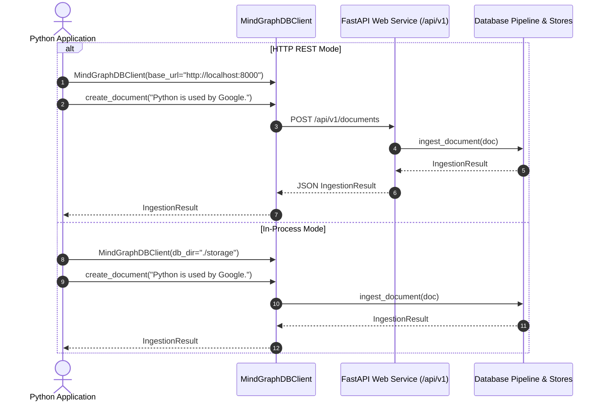

# Step 9: Python Client SDK & FastAPI Web Service Technical Specification

This document details the **Python Client SDK** (`MindGraphDBClient`) and **FastAPI REST Web Service** (`src/mind_graph_db/api/`) implemented in Step 9.

---

## 1. REST Web Service Architecture

The FastAPI service exposes database storage engines, NLP semantic extraction, automated graph discovery, and domain query execution over HTTP endpoints.

```mermaid
graph TD
    Client[Python SDK / HTTP Client] --> REST[FastAPI Service (/api/v1)]
    
    subgraph REST Endpoints
        REST --> Docs[POST/GET/PUT/DELETE /documents]
        REST --> Search[POST /search]
        REST --> Query[POST /query]
        REST --> Traverse[POST /graph/traverse]
        REST --> Evidence[GET /graph/relationships/{id}/evidence]
    end
    
    Docs --> Pipeline[DocumentIngestionPipeline]
    Search --> VectorService[VectorService / VectorStore]
    Query --> Engine[MindQueryEngine]
    Traverse --> GraphStore[SQLiteGraphStore]
    Evidence --> GraphStore
```

---

## 2. REST API Endpoint Reference

| HTTP Method | Path | Description | Request Body | Response |
| :--- | :--- | :--- | :--- | :--- |
| `POST` | `/api/v1/documents` | Ingest new document | `CreateDocumentRequest` | `IngestionResult` |
| `GET` | `/api/v1/documents/{id}` | Retrieve document by ID | None | `Document` |
| `PUT` | `/api/v1/documents/{id}` | Update document & prune stale edges | `UpdateDocumentRequest` | `IngestionResult` |
| `DELETE` | `/api/v1/documents/{id}` | Delete document & associated entries | None | `{"status": "deleted"}` |
| `POST` | `/api/v1/search` | Semantic similarity vector search | `SearchRequest` | `List[SearchResult]` |
| `POST` | `/api/v1/query` | Submit raw Mind Graph DB query | `QueryRequest` | `QueryResult` |
| `POST` | `/api/v1/graph/traverse` | Multi-hop graph traversal | `TraverseRequest` | `List[TraversalPath]` |
| `GET` | `/api/v1/graph/relationships/{id}/evidence` | Get relationship provenance evidence | None | `RelationshipEvidence` |

---

## 3. Client SDK Sequence Diagram



---

## 4. Usage Code Examples

### Python SDK Usage (Remote REST Mode or In-Process Mode)

```python
from mind_graph_db.sdk import MindGraphDBClient

# 1. Connect via HTTP REST API (or in-process embedded mode)
client = MindGraphDBClient(base_url="http://localhost:8000")
# Or embedded: client = MindGraphDBClient(db_dir="./storage")

# 2. Create and ingest document
res1 = client.create_document(
    text="Mind Graph DB is built using Python, SQLite, and FastAPI.",
    metadata={"category": "tech", "author": "Alice"},
)
print(f"Created Doc ID: {res1.document_id} | Entities Extracted: {res1.entities_extracted}")

# 3. Retrieve document
doc = client.get_document(res1.document_id)
print("Retrieved Text:", doc.text)

# 4. Semantic Similarity Search
search_results = client.semantic_search("Python database", top_k=5)
for item in search_results:
    print(f"Doc ID: {item['document_id']} | Score: {item['score']:.3f}")

# 5. Submit raw Mind Graph domain query
query_str = (
    'FIND documents '
    'WHERE semantic_match("Python database") AND metadata.category = "tech" '
    'TRAVERSE 2 HOPS '
    'RETURN documents, entities, relationships'
)
q_result = client.query(query_str, top_k=5)
print("Matching Documents:", [d.id for d in q_result.documents])

# 6. Update document (prunes stale edges automatically)
res2 = client.update_document(
    document_id=res1.document_id,
    text="Mind Graph DB is built using Python, SQLite, and OpenAI models.",
    metadata={"version": 2},
)
print(f"Updated Doc | Relationships Removed: {res2.relationships_removed}")

client.close()
```
