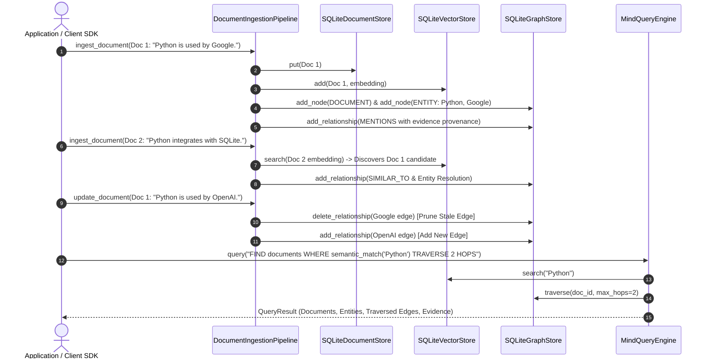

# Step 10: End-to-End Demonstration & Final System Architecture Technical Specification

This document presents the **Complete System Architecture & End-to-End Workflow** of **Mind Graph DB**, demonstrating document ingestion, embedding generation, semantic NLP extraction, custom graph storage, vector candidate discovery, entity resolution, document updates with stale relationship pruning, domain query engine execution, Python SDK, FastAPI web service, and the ASCII graph visualizer.

---

## 1. Master System Architecture Overview

Mind Graph DB is a hybrid semantic + vector + graph database built in Python without Neo4j, Qdrant, or PostgreSQL.

```mermaid
graph TD
    Client[Python SDK / HTTP REST Client] --> API[FastAPI Web Service (/api/v1)]
    API --> Pipeline[DocumentIngestionPipeline]
    API --> QueryEngine[MindQueryEngine]

    subgraph Core Subsystems
        Pipeline --> DS[SQLiteDocumentStore]
        Pipeline --> VS[SQLiteVectorStore]
        Pipeline --> GS[SQLiteGraphStore]
        Pipeline --> EM[EmbeddingModel / SentenceTransformers]
        Pipeline --> NLP[NLPModel / spaCy]
    end

    subgraph Domain Query Engine
        QueryEngine --> LexerParser[QueryLexer & QueryParser]
        LexerParser --> AST[MindQuery AST]
        AST --> Planner[QueryPlanner]
        Planner --> Executor[Plan Executor]
        Executor --> DS
        Executor --> VS
        Executor --> GS
    end
```

---

## 2. Complete End-to-End Workflow Sequence Diagram



---

## 3. Graph Visualizer Debugging Utility (`GraphVisualizer`)

Defined in [visualizer.py](file:///f:/SAAS/mind-graph-db/src/mind_graph_db/utils/visualizer.py):

### ASCII Output Example
```
=== Mind Graph DB Knowledge Graph Visualizer ===
Nodes (3 total):
  • [DOCUMENT] ID: doc-1 | Label: 'Mind Graph DB is an open source...'
  • [ENTITY] ID: e1 | Label: 'Python'
  • [ENTITY] ID: e2 | Label: 'SQLite'

Relationships (2 total):
  • 'Mind Graph DB is an open source...' --(MENTIONS, conf=1.00)--> 'Python' [Evidence: 'Document explicitly mentions entity Python']
  • 'Python' --(USES_STORAGE, conf=0.95)--> 'SQLite' [Evidence: 'Extracted SVO triple']
```

### Export Formats
- `GraphVisualizer.render_ascii(graph_store)`: CLI text tree output.
- `GraphVisualizer.export_json(graph_store)`: Structured `{"nodes": [...], "relationships": [...]}` JSON format.
- `GraphVisualizer.export_dot(graph_store)`: Graphviz `.dot` format syntax string.

---

## 4. Complete Code Usage Example

```python
from mind_graph_db.core.types import Document
from mind_graph_db.embeddings import get_embedding_model
from mind_graph_db.nlp import get_nlp_model
from mind_graph_db.pipeline import DocumentIngestionPipeline
from mind_graph_db.query import MindQueryEngine
from mind_graph_db.storage import SQLiteDocumentStore, SQLiteGraphStore, SQLiteVectorStore
from mind_graph_db.utils import GraphVisualizer

# 1. Instantiate local storage & model components
doc_store = SQLiteDocumentStore(db_path="./storage/docs.db")
vec_store = SQLiteVectorStore(db_path="./storage/vecs.db")
graph_store = SQLiteGraphStore(db_path="./storage/graph.db")

pipeline = DocumentIngestionPipeline(
    document_store=doc_store,
    vector_store=vec_store,
    graph_store=graph_store,
    embedding_model=get_embedding_model("all-MiniLM-L6-v2"),
    nlp_model=get_nlp_model("en_core_web_sm"),
    min_confidence=0.5,
)

query_engine = MindQueryEngine(
    document_store=doc_store,
    vector_store=vec_store,
    graph_store=graph_store,
    embedding_model=get_embedding_model("all-MiniLM-L6-v2"),
)

# 2. Ingest documents
doc1 = Document(text="Mind Graph DB is a hybrid semantic vector graph database.")
doc2 = Document(text="Python and SQLite provide local persistent graph storage.")
pipeline.ingest_document(doc1)
pipeline.ingest_document(doc2)

# 3. Print ASCII graph
print(GraphVisualizer.render_ascii(graph_store))

# 4. Submit query
result = query_engine.query(
    'FIND documents WHERE semantic_match("graph database") TRAVERSE 2 HOPS RETURN documents, entities, relationships'
)
print("Matched Docs:", [d.id for d in result.documents])
print("Evidence:", [r.evidence_text for r in result.relationships])

doc_store.close()
vec_store.close()
graph_store.close()
```
