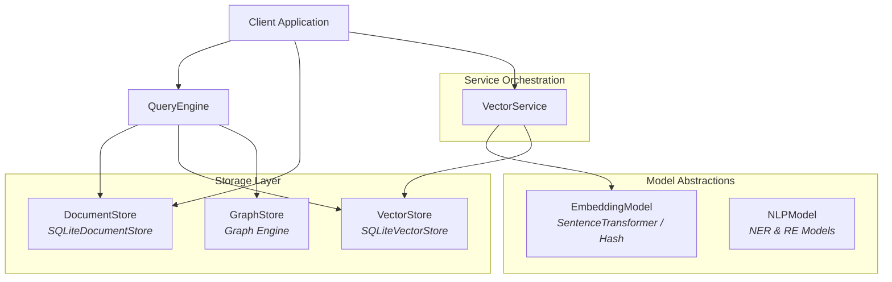
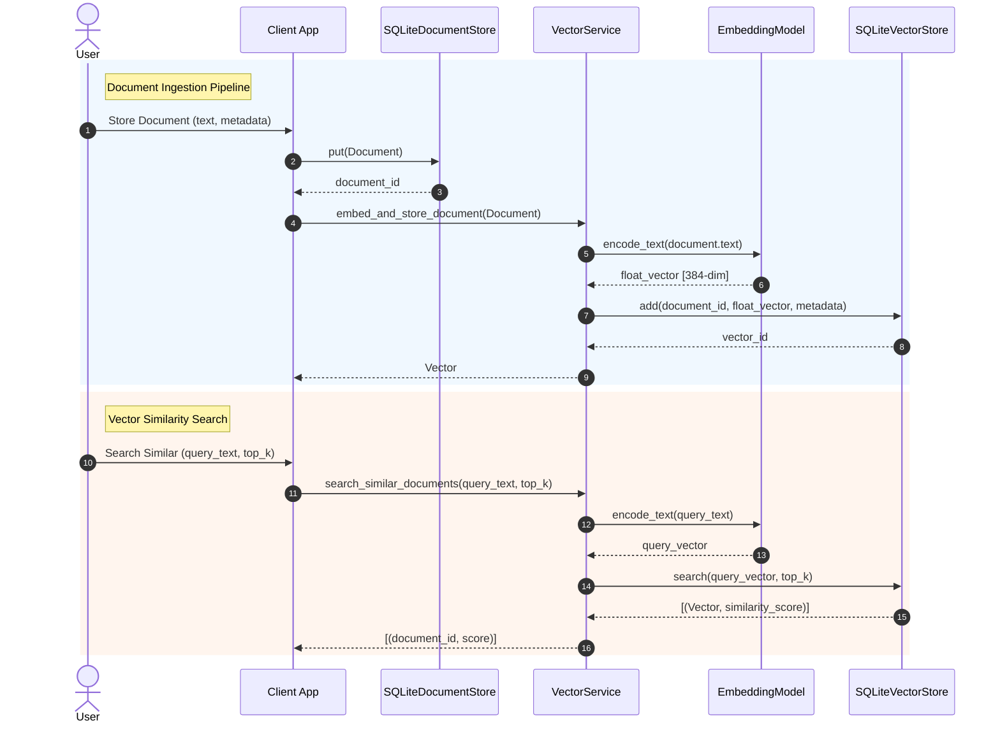

# Mind Graph DB - Technical Documentation Index & System Architecture

Welcome to the technical documentation for **Mind Graph DB**, a hybrid semantic + vector + graph database built in Python.

---

## 1. System Architecture Overview

Mind Graph DB coordinates unstructured text persistence, vector similarity indexing, open-source NLP entity/relationship extraction, and graph traversal through a decoupled architecture.

### Component Relationship Diagram

---

## 2. Ingestion & Search Data Flow

---

## 3. Step-by-Step Technical Documentation Index

Each phase of Mind Graph DB development is documented in detail below:

- **[Step 1: Foundation, Interfaces & Configuration](file:///f:/SAAS/mind-graph-db/docs/01_foundation.md)**
  - Project structure, build system (`pyproject.toml`), `Pydantic` settings, logging infrastructure, domain models (`Document`, `Entity`, `Relationship`, `Vector`, `QueryResult`), and Abstract Base Class (`ABC`) interfaces.

- **[Step 2: Document Storage Layer](file:///f:/SAAS/mind-graph-db/docs/02_document_store.md)**
  - `Document` model validation rules (auto UUID, UTC timestamps, non-empty text), `DocumentStore` interface extension (`update()`), and `SQLiteDocumentStore` local persistent storage engine.

- **[Step 3: Embedding & Vector Storage Layer](file:///f:/SAAS/mind-graph-db/docs/03_embedding_vector_store.md)**
  - Pretrained model integrations (`SentenceTransformerEmbeddingModel`, `HashEmbeddingModel`), `SQLiteVectorStore` index, exact cosine similarity math, and `VectorService` orchestrator.

- **[Step 4: Semantic Analysis Layer](file:///f:/SAAS/mind-graph-db/docs/04_semantic_analysis.md)**
  - Open-source pretrained NLP models (`SpacyNLPModel`, `RuleBasedNLPModel`), NER entity typing, noun chunk concepts, SVO `Fact` triples, `RelationshipCandidate` extraction, and `SemanticAnalysisService`.

- **[Step 5: Custom Graph Storage Layer](file:///f:/SAAS/mind-graph-db/docs/05_graph_store.md)**
  - Custom `SQLiteGraphStore` local graph engine, `GraphNode` (Entity & Document nodes), directed `Relationship` edges with confidence scores and evidence provenance, neighbor retrieval, and multi-hop BFS graph traversal algorithm.

- **[Step 6: Automatic Knowledge Graph Discovery](file:///f:/SAAS/mind-graph-db/docs/06_ingestion_pipeline.md)**
  - Automated 10-step `DocumentIngestionPipeline`, vector similarity candidate discovery, cross-document entity resolution, relationship confidence scoring, and evidence provenance logging.

- **[Step 7: Document Updates & Stale Relationship Cleanup](file:///f:/SAAS/mind-graph-db/docs/07_document_updates.md)**
  - `DocumentIngestionPipeline.update_document` workflow, embedding vector re-indexing, graph relationship reconciliation, obsolete edge pruning, and evidence timestamp updates.

- **[Step 8: Custom Domain Query Language & Execution Engine](file:///f:/SAAS/mind-graph-db/docs/08_query_engine.md)**
  - Domain-specific grammar, `QueryLexer` & `QueryParser`, `MindQuery` AST, `QueryPlanner` stages, multi-hop `MindQueryEngine`, and result ranking.

- **[Step 9: Python Client SDK & FastAPI Web Service](file:///f:/SAAS/mind-graph-db/docs/09_sdk_and_api.md)**
  - FastAPI REST service endpoints (`/documents`, `/search`, `/query`, `/graph/traverse`), dependency injection container, and `MindGraphDBClient` Python SDK (HTTP & in-process modes).

- **[Step 10: End-to-End Demonstration & Complete Architecture](file:///f:/SAAS/mind-graph-db/docs/10_end_to_end_demonstration.md)**
  - Complete system architecture recap, E2E demonstration script (`examples/demo.py`), full integration test suite, and `GraphVisualizer` debugging utility.

- **[User Manual & Complete Usage Guide](file:///f:/SAAS/mind-graph-db/docs/USER_MANUAL.md)**
  - Comprehensive user manual covering installation, Python SDK, REST API, Domain Query Language, Document Updates, and Graph Visualizer.

